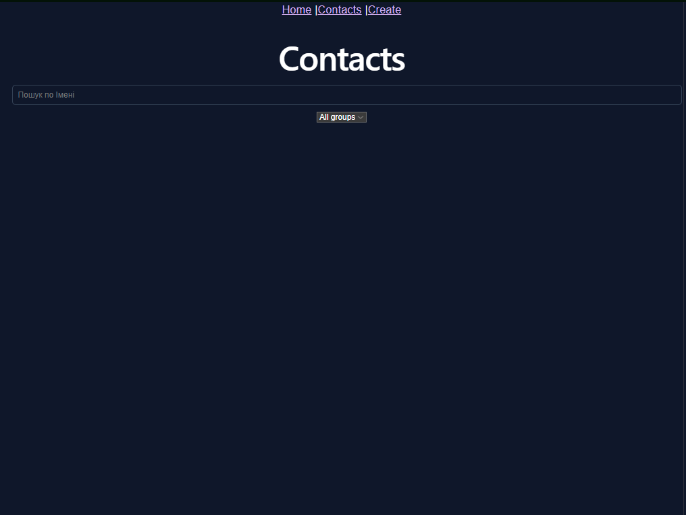
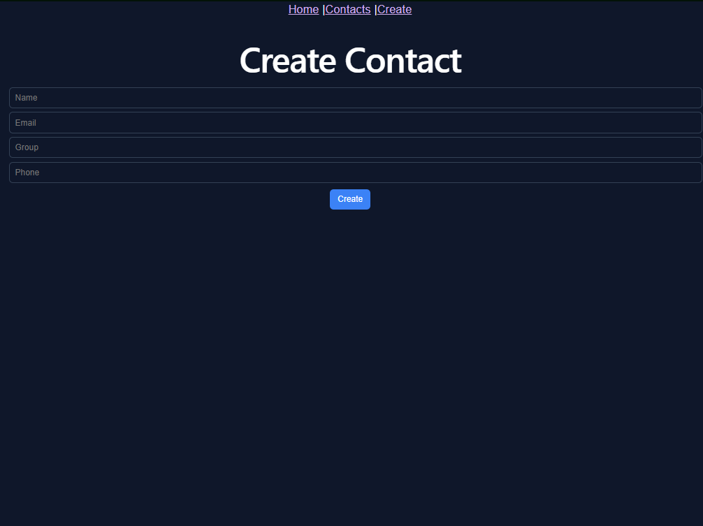
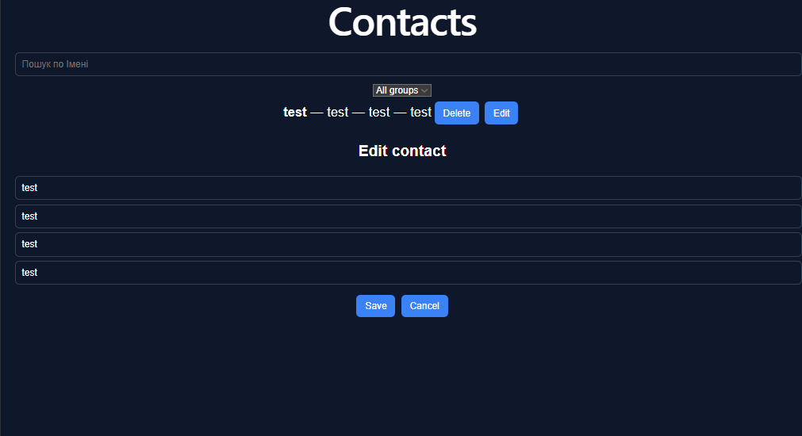

# Contact Manager

Простий застосунок для керування контактами

## Технології
- React + Vite + TypeScript
- NestJS (REST API)
- Axios
- React Router

## Функціонал
- Створення контактів
- Перегляд списку контактів
- Редагування контактів
- Видалення контактів
- Пошук контактів за ім’ям
- Фільтрація за групами (Friends, Work)

## Запуск проєкту

### Backend
cd backend  
npm install  
npm run start:dev  

### Frontend
cd frontend  
npm install  
npm run dev  

## Маршрути
- /contacts
- /create

## API
### Contacts
- GET /contacts — отримати всі контакти
- POST /contacts — створити контакт
- PUT /contacts/:id — оновити контакт
- DELETE /contacts/:id — видалити контакт

## Скриншоти

### Список контактів

### Створення контакту

### Редагування

## Примітка
Дані зберігаються в пам’яті сервера, тому після перезапуску вони очищуються.